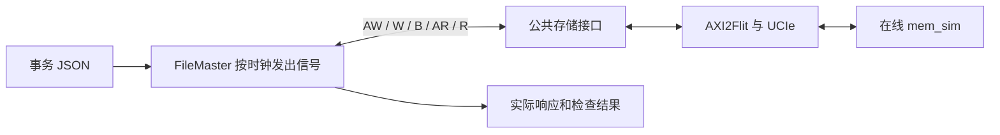

# 第一次运行：写入并读回一个数字

[返回文档目录](README.md)。

这里先做一件具体的事：向一个地址写入数字 41，再从同一地址读回来，检查仍然是 41。
本项目只负责存储读写；“加一得到 42”是另两个计算项目的程序所做的事情。

## 1. 到正确目录，检查构建条件

在本工作区可以执行：

```bash
cd /home/hy258/hy/zhongxing/axi_StorageStacked
pwd
./run.sh setup
```

`pwd` 应显示 AXI 仓库目录。其他机器使用自己放置仓库的路径。
`./` 表示“当前目录中的”，所以在 `docs/` 内直接执行 `./run.sh` 会找不到脚本。

需要 Linux x86-64、Bash、Python 3、CMake 3.20 或以上、make、支持 C++20 的编译器及 Boost 头文件。
顶层 AXI 接入使用 C++17，内部 mem_sim 还需要 C++20，准备工具时按较高要求检查。
SystemC 源码已在 `third_party/systemc/`，这条独立运行路径不需要手工安装另一套 SystemC。

`setup` 检查基础命令和源码是否存在，不会替你安装全部系统包，也不会完成编译。
如果它成功但后面的编译报 Boost 或编译器版本错误，仍应按编译错误补齐依赖。

## 2. 编译一次，再运行

```bash
BUILD_JOBS=4 ./run.sh build
./run.sh smoke
```

`BUILD_JOBS=4` 表示最多并行编译四份任务，影响现实机器的编译资源占用。
它不会把模拟设备改为四核。默认并行数是 12，可按机器资源调整。

`build` 的主要输出是 `build/axi_storage` 和它依赖的库。
`smoke` 使用固定六笔事务，检查初始零值、多拍写读、部分字节写入及响应等待。
终端打印新结果目录；最终要求 `summary.json.passed`、`summary.json.smoke_passed`
和 `smoke_summary.json.passed` 都为 `true`。

## 3. 写一个自己的最小输入

仍在 AXI 仓库根目录，新建 `examples/first_io.json`：

```bash
cat > examples/first_io.json <<'JSON'
{
  "config": {},
  "transactions": [
    {
      "command": "write",
      "id": 1,
      "address": 2415919104,
      "size": 2,
      "data": ["29000000"],
      "strobe": [15]
    },
    {
      "command": "read",
      "id": 2,
      "address": 2415919104,
      "size": 2,
      "beats": 1,
      "expected": ["29000000"]
    }
  ]
}
JSON
./run.sh run --input examples/first_io.json --output results/first-io
```

`results/first-io` 必须尚不存在。重跑可省略 `--output`，让入口自动创建新目录。
上面的文件创建命令会写入指定文件；如果已保存自己的同名输入，先换一个名称。

| 文件中的写法 | 实际意思 |
|---|---|
| `config: {}` | 使用存储和时钟的默认参数 |
| `transactions` | 按顺序执行的读写清单，前一笔完成后再执行下一笔 |
| `address: 2415919104` | 地址 `0x90000000`，JSON 这里要求十进制整数 |
| `size: 2` | 每拍 `2² = 4` 字节；这里的 2 是编码 |
| `data: ["29000000"]` | 传一拍，四个字节依次为 `29 00 00 00` |
| `strobe: [15]` | `15 = 0b1111`，这四个字节都允许写入 |
| `beats: 1` | 读一拍，信号上的 `ARLEN` 则是 `1 - 1 = 0` |
| `expected` | 读回后的检查答案，不会用它填充内存 |

`29` 是十六进制的 41。这里按低地址到高地址列字节，所以小端整数 41 写成 `29000000`。
如果写成 `00000029`，字节顺序已经变了，不能再当成相同整数。

## 4. JSON 怎样变成五通道

五通道就是五类信息，各自有“我准备好了”和“我能接收”的握手：

| 通道 | 发送方向 | 本例承载的信息 |
|---|---|---|
| AW | 主端 → 存储 | 写哪里、ID、拍数、每拍大小 |
| W | 主端 → 存储 | 四个数据字节、写掩码、最后一拍标志 |
| B | 存储 → 主端 | 写完成的状态和 ID |
| AR | 主端 → 存储 | 读哪里、ID、拍数、每拍大小 |
| R | 存储 → 主端 | 实际读出的字节、状态、ID 和最后一拍标志 |

`FileMaster` 根据 JSON 产生 AW/W/AR，并控制 `BREADY/RREADY` 接收响应。
文件不需要填写 B/R 返回内容，也不接受顶层 `AW`、`W`、`AR` 等自定义字段。



握手发生在时钟上升沿且 `VALID=1`、`READY=1` 时。
如果 `VALID=1`、`READY=0`，数据还没被接收，发送方必须保持内容等待。

## 5. 看自己这次的结果

```bash
cat results/first-io/responses.json
cat results/first-io/summary.json
```

预期有两条响应：写操作 `data` 为空数组；读操作 `data` 为 `["29000000"]`。
两笔 `response` 都应是 `0`，即成功状态 OKAY。
`summary.json.passed=true` 表示入口的返回字节、协议、波形、链路和内存检查全部通过。

| 想确认的事情 | 文件 |
|---|---|
| 本次实际用的配置和事务 | `input.json` |
| AXI 上实际握手了几次 | `axi_events.csv` |
| 哪一拍正在等 READY | `axi_wave.vcd` |
| 内存模型是否真的接收并完成请求 | `memsim_bridge.csv`、`memsim_check.json` |
| 失败原因 | `summary.json` 和 `run.log` |

时间字段标有 fs。`1 ns = 1,000,000 fs`；结束时刻减开始时刻再除以 1,000,000，
得到这笔操作的纳秒数。它包含模型链路中的等待，不能只解释成 DRAM 本身的延迟。

## 6. 每次只改一个参数

想比较慢内存，可以复用同一份输入：

```bash
./run.sh run --input examples/first_io.json --output results/normal-memory
./run.sh run --input examples/first_io.json --scale 4 --output results/slow-memory
```

`--scale 4` 覆盖 JSON 中的 `config.scale`，把内存模型的时间步长放大。
两个结果的数据应相同；时间以实际输出为准，整段操作耗时不保证恰好变为四倍，
因为启动、AXI、链路和响应等待各有自己的耗时。

| 修改内容 | 下一步 |
|---|---|
| 事务、地址、数据、掩码、JSON 中允许的运行配置 | 直接用 `run --input` 新建一次运行 |
| C++、公共存储代码、编译期链路参数 | 先 `./run.sh build`，再运行和检查 |
| 想改六笔 SMOKE 的输入 | 复制 JSON 后使用 `run`；固定 `smoke` 另有专用覆盖要求 |
| 想改更深层 DRAM 配置 | 先看 [输入说明](INPUTS.md) 和 [SMOKE 指南](03-从零添加SMOKE测试.md)，在线路径不直接读取独立实验的 cfg |

## 7. 常见问题按这个顺序排查

| 现象 | 检查位置与处理 |
|---|---|
| 找不到 `./run.sh` | 用 `pwd` 查看位置，回 AXI 仓库根目录 |
| 找不到 `build/axi_storage` | 先完成 `./run.sh build` |
| JSON 解析错误 | 检查英文双引号、逗号；去掉注释和最后一项后多余的逗号 |
| 报 `Invalid transaction fields` | 只使用输入文档列出的字段，不能填逐周期信号名 |
| 地址报错 | 用十进制整数；地址按每拍大小对齐；一个 burst 不跨 4 KiB |
| 每拍字节数不对 | `size=2` 需要 8 个十六进制字符；`size=5` 需要 64 个 |
| 结果目录已存在 | 换新名称或省略 `--output` |
| 读回和期望不同 | 对照写地址、字节顺序、strobe；掩码为 0 的字节保留原值 |
| 出现超时 | 先查 `run.log` 中训练、请求和返回的进度，再判断是否需要增加 `max_ticks` |

完整字段范围见 [INPUTS.md](INPUTS.md)。是否完成本次验收，以新结果目录中的实际检查结果为准。
